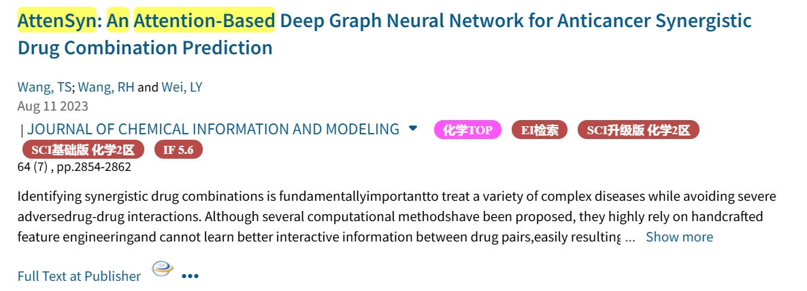
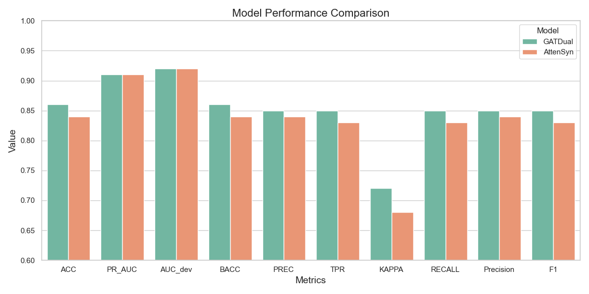

# AttenSyn: An Attention-Based Deep Graph Neural Network forAnticancer Synergistic Drug Combination Prediction

# Data

Download data.pt file from [here](https://drive.google.com/file/d/1Gqt4HxbUVILIbp17L6e_zLGA_3sVKOw1/view?usp=sharing), and put it into data directory  

 

# Paper result

| Methods     | AUROC       | AUPR        | ACC         | BACC        | PREC        | TPR         | KAPPA       |
| ----------- | ----------- | ----------- | ----------- | ----------- | ----------- | ----------- | ----------- |
| AttenSyn    | 0.92 ± 0.01 | 0.91 ± 0.01 | 0.84 ± 0.01 | 0.84 ± 0.02 | 0.83 ± 0.02 | 0.82 ± 0.03 | 0.67 ± 0.03 |
| DTSyn       | 0.89 ± 0.01 | 0.87 ± 0.01 | 0.81 ± 0.01 | 0.81 ± 0.02 | 0.84 ± 0.02 | 0.74 ± 0.05 | 0.61 ± 0.03 |
| MR-GNN      | 0.90 ± 0.01 | 0.90 ± 0.01 | 0.82 ± 0.01 | 0.82 ± 0.01 | 0.81 ± 0.02 | 0.80 ± 0.03 | 0.65 ± 0.02 |
| DeepSynergy | 0.72 ± 0.01 | 0.77 ± 0.03 | 0.72 ± 0.01 | 0.72 ± 0.01 | 0.73 ± 0.05 | 0.64 ± 0.02 | 0.43 ± 0.02 |
| RF          | 0.74 ± 0.03 | 0.73 ± 0.03 | 0.67 ± 0.01 | 0.67 ± 0.02 | 0.70 ± 0.07 | 0.59 ± 0.03 | 0.35 ± 0.04 |
| Adaboost    | 0.74 ± 0.02 | 0.72 ± 0.03 | 0.75 ± 0.02 | 0.66 ± 0.02 | 0.63 ± 0.08 | 0.69 ± 0.08 | 0.32 ± 0.04 |
| SVM         | 0.68 ± 0.05 | 0.65 ± 0.06 | 0.62 ± 0.05 | 0.62 ± 0.05 | 0.59 ± 0.05 | 0.66 ± 0.06 | 0.25 ± 0.09 |
| MLP         | 0.84 ± 0.01 | 0.82 ± 0.01 | 0.76 ± 0.01 | 0.75 ± 0.01 | 0.75 ± 0.01 | 0.71 ± 0.01 | 0.50 ± 0.02 |
| Elastic net | 0.68 ± 0.08 | 0.67 ± 0.07 | 0.63 ± 0.07 | 0.63 ± 0.07 | 0.61 ± 0.08 | 0.62 ± 0.07 | 0.27 ± 0.14 |

 

# My Reproduction

**Final Result**：KAPPA提升5个点；ACC提升2个点；BACC提升2个点；PREC提升两个点；TPR提升3个点；F1分数提升2个点。

 

## First edition：

| Methods  | AUROC  |  AUPR  |  ACC   |  BACC  |  PREC  |  TPR   | KAPPA  |
| :------: | :----: | :----: | :----: | :----: | :----: | :----: | :----: |
| AttenSyn |  0.92  |  0.91  |  0.84  |  0.84  |  0.83  |  0.82  |  0.67  |
| dual-GAT |  0.92  |  0.91  |  0.86  |  0.86  |  0.85  |  0.85  |  0.69  |
|  GATGCN  | 0.9220 | 0.9158 | 0.8531 | 0.8533 | 0.8395 | 0.8574 | 0.7059 |
| dual-GCN | 0.9182 | 0.9104 | 0.8493 | 0.8483 | 0.8566 | 0.8235 | 0.6977 |
|   GAT    | 0.9173 | 0.9110 | 0.8542 | 0.8536 | 0.8546 | 0.8385 | 0.7077 |

 

## Second edition

| Model    | ACC  | PR_AUC | AUC_dev | BACC | PREC | TPR  | KAPPA | RECALL | Precision | F1   |
| -------- | ---- | ------ | ------- | ---- | ---- | ---- | ----- | ------ | --------- | ---- |
| GATDual  | 0.86 | 0.91   | 0.92    | 0.86 | 0.85 | 0.85 | 0.72  | 0.85   | 0.85      | 0.85 |
| AttenSyn | 0.84 | 0.91   | 0.92    | 0.84 | 0.84 | 0.83 | 0.68  | 0.83   | 0.84      | 0.83 |

 

# Evaluation

在对比AttenSyn和GAT-DualAttention模型的性能时，从多个指标进行以下分析。

1. ACC指标：AttenSyn的ACC为0.84，而GAT-Dual提升至0.86，在分类准确性上有显著提升。
2. PR_AUC指标：AttenSyn的PR_AUC为0.91，GAT-Dual保持相同的0.91，在精确率-召回率曲线下的面积上保持了高水平。
3. AUC_dev指标：AttenSyn的AUC_dev为0.92，GAT-Dual同样保持0.92，在开发集上的分类能力与AttenSyn相当。
4. BACC指标：AttenSyn的BACC为0.84，而GAT-Dual提升至0.86，在类别不平衡数据上的鲁棒性更强。
5. PREC指标：AttenSyn的PREC为0.84，GAT-Dual提升至0.85，在精确率上有所提升。
6. TPR指标：AttenSyn的TPR为0.83，GAT-Dual提升至0.85，在召回率上有所提升。
7. **KAPPA系数**：AttenSyn的KAPPA系数为0.67，而GAT-Dual提升至0.72，模型的分类结果与真实标签的一致性显著提高。
8. RECALL指标：AttenSyn的RECALL为0.83，GAT-Dual是0.85。
9. Precision指标：AttenSyn的Precision为0.84，GAT-Dual是0.85
10. F1 Score指标：AttenSyn的F1 Score为0.83，GAT-Dual提升至0.85，在精确率和召回率之间取得了更好的平衡。

