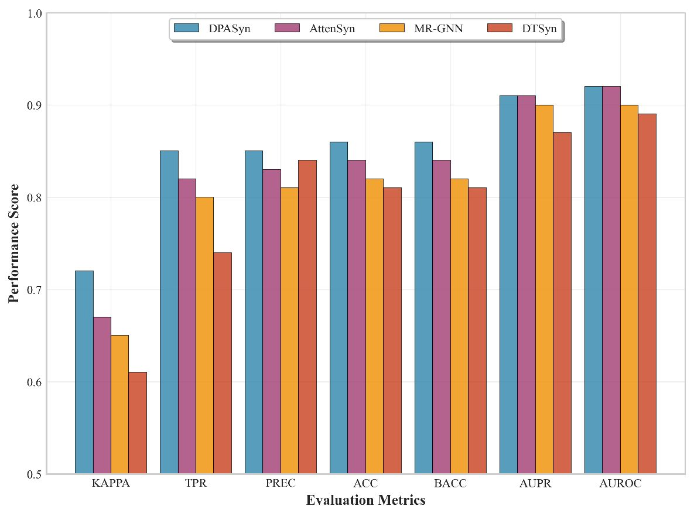

# DPASyn

This repository contains the source code for the paper **"DPASyn: Mechanism-Aware Drug Synergy Prediction via Dual Attention and Precision-Aware Quantization"**.


## 🌟 Abstract

Drug combinations are essential in cancer therapy, leveraging synergistic drug-drug interactions (DDI) to enhance efficacy and combat resistance. However, the vast combinatorial space makes experimental screening impractical, and existing computational models struggle to capture the complex, bidirectional nature of DDIs, often relying on independent drug encoding or simplistic fusion strategies that miss fine-grained inter-molecular dynamics. Moreover, state-of-the-art graph-based approaches suffer from high computational costs, limiting scalability for real-world drug discovery. To address this, we propose DPASyn, a novel drug synergy prediction framework featuring a dual-attention mechanism and Precision-Aware Quantization (PAQ). The dual-attention architecture jointly models intra-drug structures and inter-drug interactions via shared projections and cross-drug attention, enabling fine-grained, biologically plausible synergy modeling. While this enhanced expressiveness brings increased computational resource consumption, our proposed PAQ strategy complements it by dynamically optimizing numerical precision during training based on feature sensitivity—reducing memory usage by 40\% and accelerating training threefold without sacrificing accuracy. With LayerNorm-stabilized residual connections for training stability, DPASyn outperforms seven state-of-the-art methods on the O'Neil dataset (13,243 combinations) and supports full-batch processing of up to 256 graphs on a single GPU—setting a new standard for efficient and expressive drug synergy prediction.


## ✨ Comparison




## 🔨 Getting Started

Before running the model, please ensure that the data is correctly set up.

**Step 1: Prepare the Data** 

Refer to the `Data.md` file located in the `data/` directory for detailed instructions on how to download and preprocess the dataset.

> 💡 The default data path used by the script is `data/data.pt`. Make sure your processed data is placed accordingly.

**Step 2: Run the Training Script** 

Navigate to the `src/` directory and run the main script:

```bash
cd src
python main.py
```

By default, the script will train the model using the configuration specified in the code. You can modify hyperparameters directly in `main.py` or extend it to support command-line arguments if needed. 

## 📤 Contact

If you have any questions or need further assistance, feel free to reach out via email:  📧 nyxchaoji123@163.com. 

## 🙌 Acknowledgements

We gratefully acknowledge the support from the Yunnan Provincial Basic Research Youth Project. We also thank our supervisor for guidance and [sweetyoungthing](https://github.com/sweetyoungthing) for assistance.
